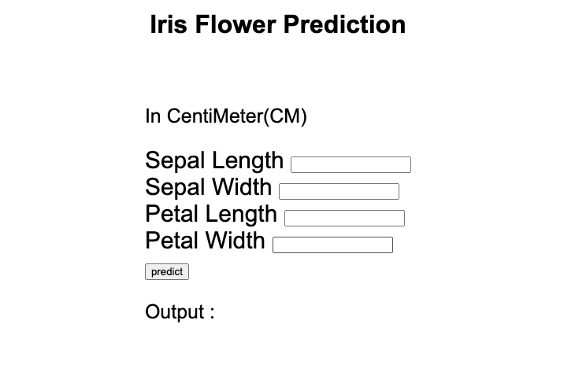
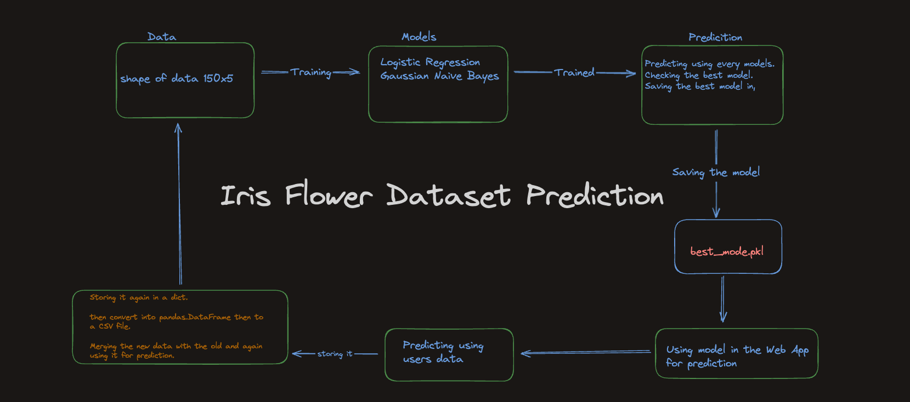
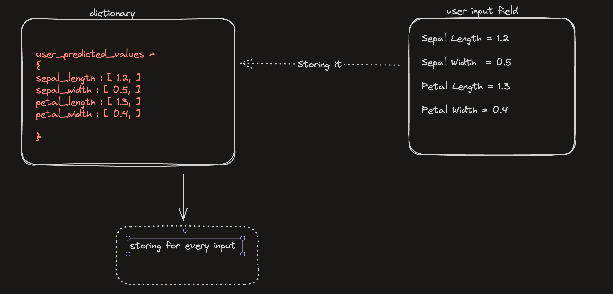

# Just Readme Once

## What is the approach

Building a Machine Learning Web App using Flask. Using the Iris-Flower Dataset. It contains 150x5 no. of data which is good not enough. So we'll store all the data that we are getting as input from the App to predict , store it to a dictionary, Then converting it into csv and training the model again for better accuracy and results.

## Image of the Site

## Flow Chart 

## Dictionary for storing , Flow Chart

